# Dokumentacja projektowa

### Aplikacja webowa umożliwiająca zamówienie kuriera w celu wysłania przesyłki oraz analiza i wizualizacja danych dotyczących wykorzystania serwisu przez użytkowników.

# Spis treści
1. [Opis projektu](#opis-projektu)
  - [Analiza wymagań funkcjonalnych](#analiza-wymagań-funkcjonalnych)
    - [Gość](#gość)
    - [Użytkownik](#użytkownik)
    - [Admin](#admin)
  - [Wykorzystane technologie oraz biblioteki](#wykorzystane-technologie-oraz-biblioteki)
    - [Lista technologii wykorzystanych w projekcie](#lista-technologii-wykorzystanych-w-projekcie)
    - [Biblioteki wykorzystane do generowania wykresów](#biblioteki-wykorzystane-do-generowania-wykresów)
2. [Przykładowe użycie aplikacji](#przykładowe-użycie-aplikacji)
  - [Przeglądanie statystyk](#przeglądanie-statystyk)
  - [Proces zamówienia kuriera](#proces-zamówienia-kuriera)
  - [Przegląd rankingu kurierów](#przegląd-rankingu-kurierów)
# Opis projektu
Stworzona przez nas aplikacja webowa umożliwia zamówienie kuriera w celu
wysłania przesyłki. Każdy gość odwiedzający nasz serwis uzyskuje możliwość wyceny
przesyłki bez rejestracji. Może przeglądać ranking kurierów, opinie na temat firm kurierskich
oraz ranking ich popularności. Jeżeli gość zdecyduje się na skorzystanie z naszych usług
najpierw musi zarejestrować się w naszym serwisie. Po rejestracji użytkownik może przejść
do procesu zamówienia przesyłki. Składa się on z podania informacji o przesyłce, wyboru
interesującego nas kuriera, podania danych nadawcy i odbiorcy oraz zatwierdzenia
zamówienia. Dodatkowo po każdym złożonym zamówieniu klient otrzymuje punkty premium,
które może wykorzystać w sklepie premium, w celu odebrania nagrody. Użytkownik może
przeglądać wszystkie złożone przez niego zamówienia, oraz ocenić każde zamówienie
w formie wystawienia opinii dla wybranej przez niego firmy kurierskiej. Jeżeli przesyłka nie
została jeszcze wysłana ma możliwość anulowania zamówienia. Po zalogowaniu na konto
admina możemy zarządzać serwisem zamawiania paczek m.in. zmieniać status zamówień,
dodawać nowych kurierów do bazy, dodawać prezenty oraz modyfikować bazę danych.
Ważną funkcjonalnością admina jest również analiza danych dotyczących wykorzystywania
serwisu przez użytkowników. Realizowana jest ona w formie wykresów, które generowane
są na podstawie informacji zawartych w bazie danych.

### Analiza wymagań funkcjonalnych
#### Gość
- Gość może utworzyć konto w naszej aplikacji.
- Gość może przeglądać dostępnych kurierów oraz cennik.
- Gość może obliczyć cenę przesyłki.
- Gość może przeglądać ranking kurierów.
- Gość może przeglądać opinie dotyczące kurierów.
#### Użytkownik
- Użytkownik może tworzyć/edytować/aktualizować swoje dane adresowe.
- Użytkownik może zamówić kuriera, by nadać paczkę.
- Użytkownik może wybrać kuriera z listy kurierów.
- Użytkownik może wyświetlać swoje zamówienia.
- Użytkownik może anulować swoje zamówienie.
- Użytkownik może obliczyć koszty wysłania paczki.
- Użytkownik może wystawiać opinie po złożonym zamówieniu
- Użytkownik może zbierać punkty premium.
- Użytkownik może użyć punktów premium do odebrania prezentów.
#### Admin
- Admin może przeglądać statystyki realizowane w formie wykresów.
- Admin może zarządzać bazą danych.

### Wykorzystane technologie oraz biblioteki
Aplikacja webowa została stworzona w oparciu o framework Django przeznaczony
do tworzenia aplikacji internetowych. System zarządzania bazą danych wykorzystywany
w naszym projekcie to SQLlite.
#### Lista technologii wykorzystanych w projekcie:
- Python: 3.6.6
- Django: 2.1.2
- HTML5
- CSS3
- JavaScript
- JQuery: 3.1
- Bootstrap: 4.1.3
#### Biblioteki wykorzystane do generowania wykresów:
- FusionCharts
- GoogleCharts
- Plotly

# Przykładowe użycie aplikacji
### Przeglądanie statystyk
- Logujemy się do aplikacji jako administrator aby podglądnąć statystyki serwisu.
 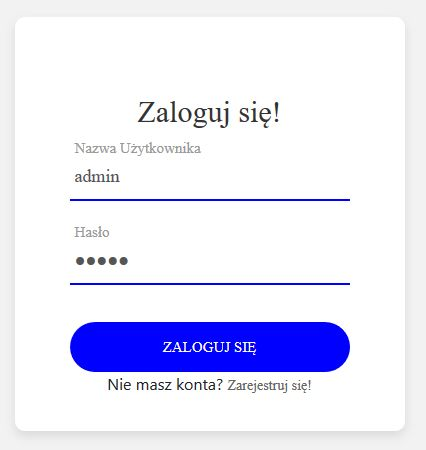  
- Po kliknięciu w zakładkę “Wykresy” przenosimy się do podstrony ze statystykami.
   
- Wykres słupkowy obrazujący liczbę wszystkich zamówień dla wszystkich firm kurierskich w naszym serwisie.
 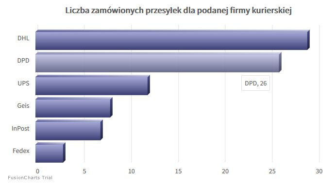  
- Wykres liniowo-punktowy obrazujący szczegółowo liczbę zamówień w każdym dniu.
 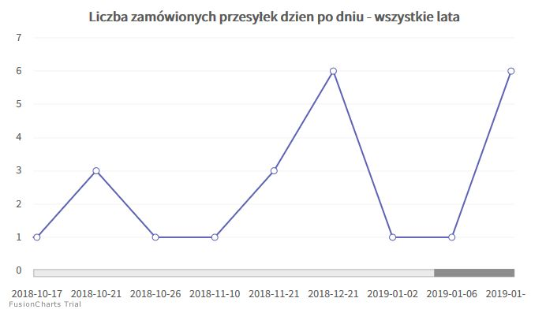  
- Wykres słupkowy przedstawiający liczbę zamówionych przesyłek w danym miesiącu
po wybraniu konkretnego roku kalendarzowego.
 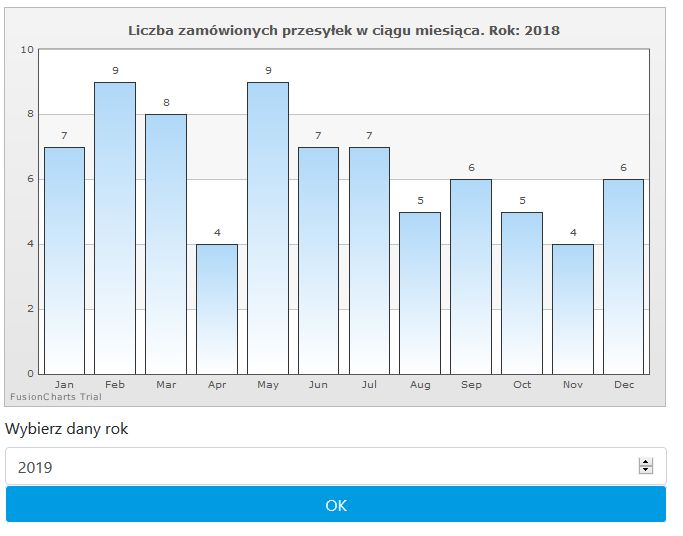  
- Wykres słupkowy obrazujący z jakiej miejscowości są użytkownicy
 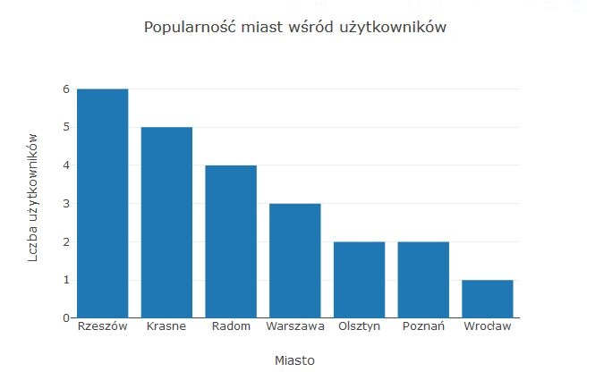  
- Wykres punktowo-liniowy obrazujący przychody w danym miesiącu kalendarzowym
 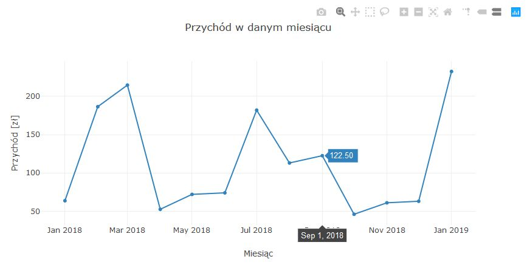  
- Wykres słupkowy przedstawiający średnią ocenę firm kurierskich wystawianych
przez użytkowników
 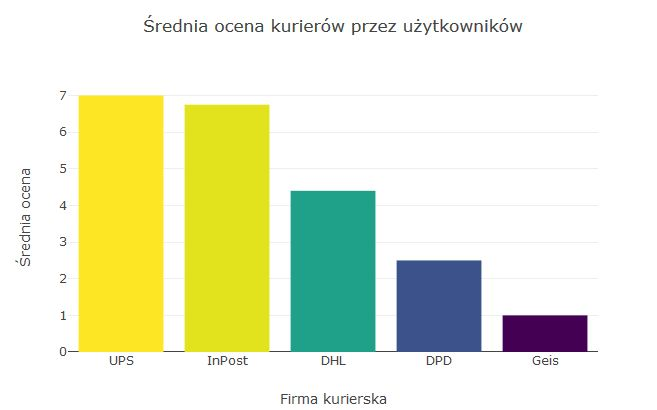  

### Proces zamówienia kuriera
- Rozpoczynamy od wyboru rodzaju przesyłki.
 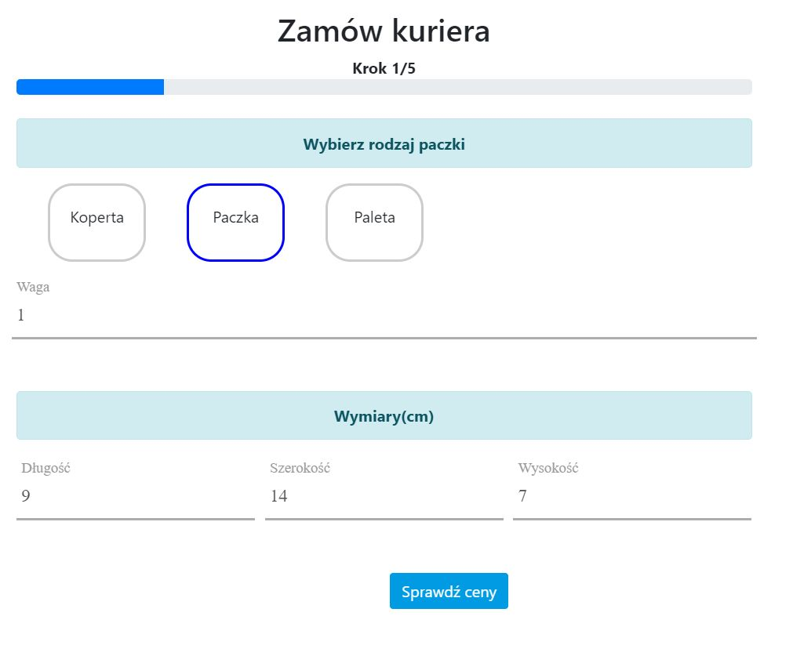  
- Następnie wybieramy firmę kurierską. Każda firma posiada inny cennik.
 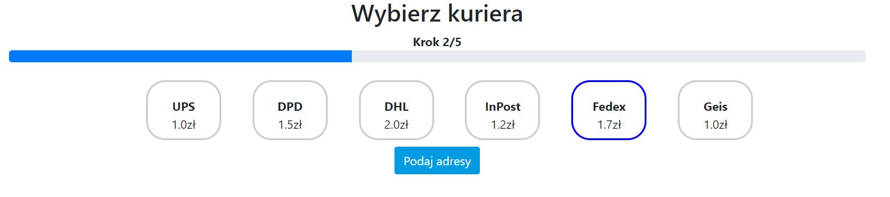  
- Kolejny krokiem jest podanie adresu nadawcy.
 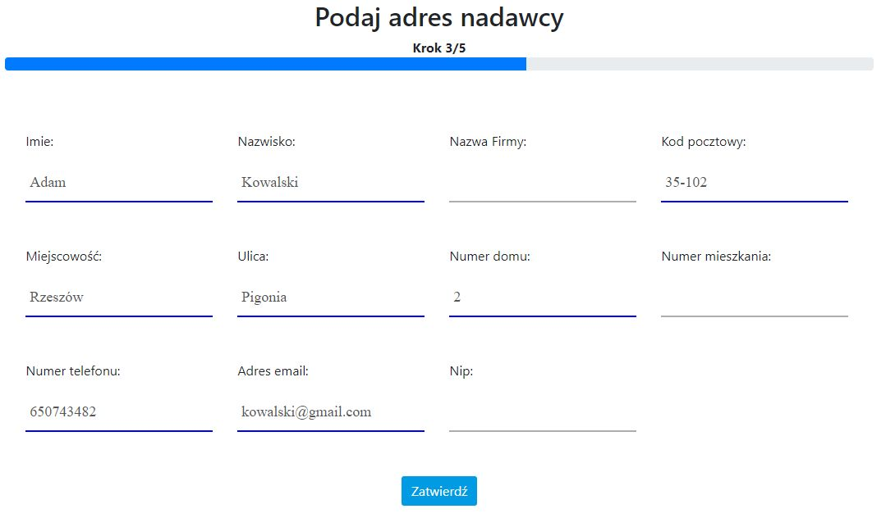  
- Następnie podajemy adres odbiorcy.
 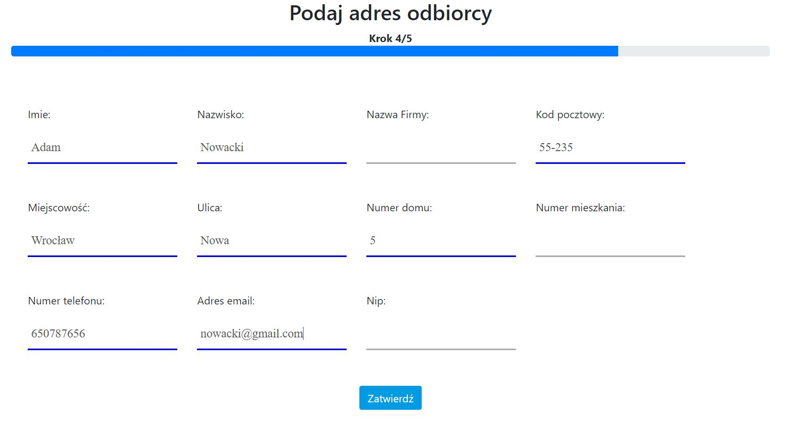  
- Gdy uzupełniliśmy wszystkie dane poprawnie możemy potwierdzić nasze
zamówienie.
 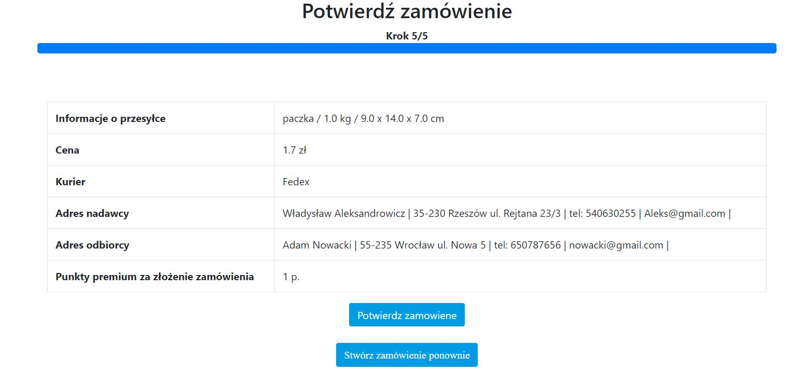  
- Gdy złożymy zamówienie, możemy sprawdzić jego stan w zakładce zamówienia -
możemy również dodać ocenę lub anulować zamówienie.
 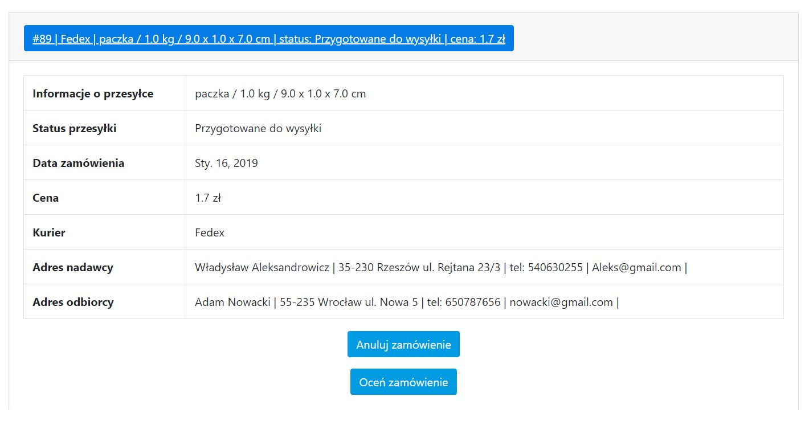  
- Przykładowe wystawienie oceny dla wcześniejszego zamówienia
 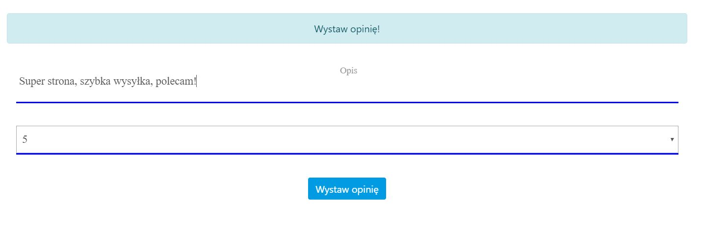  
- W zakładce “Cennik” możemy zobaczyć opinie dla danych firm.
 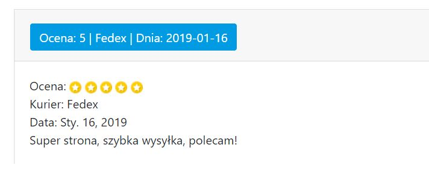  

### Przegląd rankingu kurierów
Każdy użytkownik serwisu może przeglądnąć nasz ranking firm kurierskich.
- 5 Najpopularniejsz firm kurierskich (procentowy udział w liczbie zamówień)
 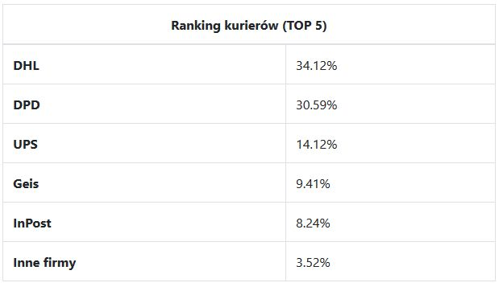  
- Wykres kołowy przedstawia procentowo powyższe dane
 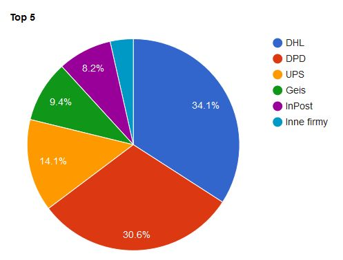  
